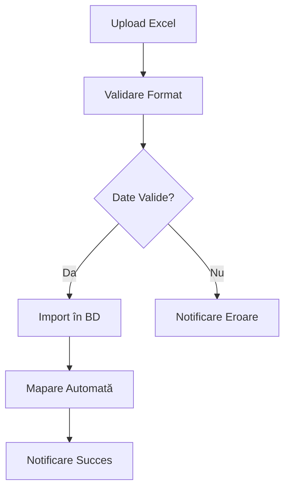
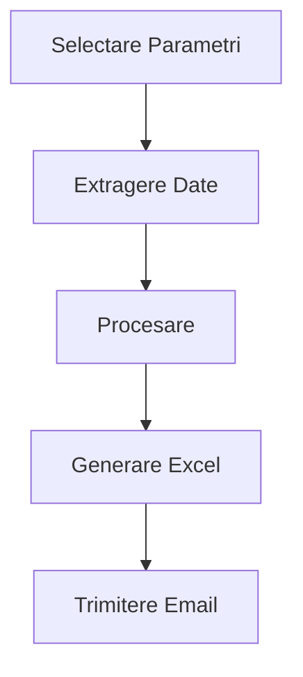

# Documentație Aplicație RAS Expeditors

## 1. Structura Aplicației

### 1.1 Componente Principale
- **Flask Backend** (`website/`)
  - Views și rute
  - Autentificare
  - Procesare date
  - Integrare cu baza de date
- **Frontend** (`website/templates/`)
  - Interfață web
  - JavaScript pentru interactivitate
- **Worker Celery** pentru task-uri asincrone
- **Bază de date MySQL**
- **Servicii Azure** (Redis Cache)

### 1.2 Fișiere Principale
- `__init__.py` - Configurare aplicație Flask
- `views.py` - Rutele principale ale aplicației
- `auth.py` - Autentificare și management utilizatori
- `tasks.py` - Task-uri Celery
- `insert_GL.py` - Procesare și import date GL
- `procedurasql.py` - Proceduri SQL pentru mapare
- `sendMails.py` - Trimitere emailuri prin Microsoft Graph API

## 2. Funcționalități Principale

### 2.1 Procesare Date Contabile
- Import GL (General Ledger)
- Mapare conturi
- Generare rapoarte
- Export date

### 2.2 Management Utilizatori
- Autentificare
- Roluri și permisiuni
- Gestionare sesiuni

### 2.3 Raportare
- Generare balanțe
- Rapoarte sold clienți/furnizori
- Export Excel
- Trimitere automată pe email

### 2.4 Task-uri Asincrone
- Import date în background
- Procesare fișiere mari
- Mapare automată

## 3. Fluxuri de Date

### 3.1 Import GL
1. Upload fișier Excel
2. Procesare asincronă (Celery)
3. Validare date
4. Import în baza de date
5. Mapare automată (opțional)

### 3.2 Generare Rapoarte
1. Selectare parametri (perioadă, tip raport)
2. Extragere date din BD
3. Procesare și formatare
4. Export Excel
5. Trimitere pe email

## 4. Configurații și Dependențe

### 4.1 Bază de Date
```json
{
    "mysql": {
        "host": "efactura.mysql.database.azure.com",
        "user": "useradmin",
        "password": "***",
        "database": "soft_contabil_database"
    }
}
```

### 4.2 Azure Redis Cache
- Broker Celery
- Backend pentru rezultate
- SSL configurat

### 4.3 Email (Microsoft Graph API)
- Autentificare OAuth
- Trimitere emailuri cu atașamente
- Template-uri predefinite

## 5. Procese Principale

### 5.1 Import GL și Mapare


### 5.2 Generare Rapoarte


## 6. Tabele Principale Bază de Date

### 6.1 general_ledger
- Month
- Year
- GL
- Description
- Opening_balance
- Open_DC
- MTD_Debit
- MTD_Credit
- YTD_Debit
- YTD_Credit
- Ending_balance
- End_DC
- Statutory_GL (poate fi NULL)
- created_at

### 6.2 mapping
- GL
- Br
- Statutory_GL
- Statutory_Type
- Transaction_Type
- Headers
- TC

## 7. Task-uri Celery

### 7.1 import_gl_task
- Procesare fișier Excel
- Import în baza de date
- Logging și monitorizare
- Notificări de status

### 7.2 mapare_gl_task
- Mapare automată GL-uri
- Actualizare statutory_gl
- Validări

## 8. Securitate și Permisiuni

### 8.1 Autentificare
- Sesiuni Flask
- Login manager
- Role-based access

### 8.2 Protecție Date
- Validare input
- Escape SQL
- SSL pentru conexiuni

## 9. Frontend

### 9.1 Template-uri Principale
- `main.html` - Layout principal
- `vizualizare_rapoarte.html` - Vizualizare și export date
- `load_transform.html` - Upload și procesare

### 9.2 JavaScript
- Validare formulare
- AJAX pentru actualizări async
- Manipulare DOM
- Export Excel

## 10. Mentenanță și Debugging

### 10.1 Logging
- Log-uri aplicație
- Log-uri Celery
- Log-uri SQL

### 10.2 Monitorizare
- Status task-uri
- Performanță Redis
- Erori și excepții

## 11. Recomandări de Dezvoltare

### 11.1 Adăugare Features
1. Creează branch nou
2. Implementează funcționalitatea
3. Testează local
4. Actualizează documentația
5. Merge în main

### 11.2 Troubleshooting
1. Verifică log-uri
2. Testează conexiunile
3. Verifică permisiunile
4. Monitorizează task-urile Celery

## 12. API-uri și Integrări

### 12.1 Microsoft Graph API
- Trimitere emailuri
- Atașamente
- Template-uri HTML

### 12.2 Azure Services
- Redis Cache
- MySQL Database
- Key Vault (recomandat pentru secrets)

## 13. Backup și Recuperare

### 13.1 Bază de Date
- Backup zilnic
- Retenție 30 zile
- Procedură de restore

### 13.2 Fișiere
- Backup config
- Backup template-uri
- Backup log-uri
